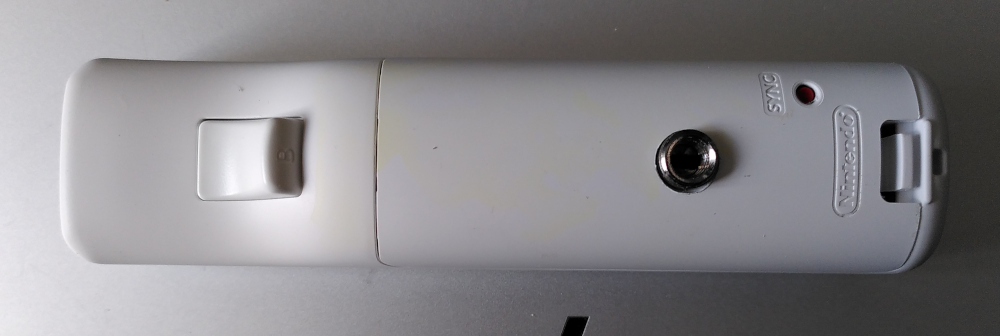

# Wiimote4Linux
This is an implementation of the [Wii Remote based interactive whiteboard idea](http://johnnylee.net/projects/wii/) for Linux. It allows you to use a Wii Remote and an IR pen to create a cheap interactive whiteboard ("activeboard") with any common digital projector. As additional features, you can use the Wiimote as presenter and digital laser pointer. The software also features simple on-screen drawing functionalities.

## Hardware
Both the original Wii Remote and Wii Remote Plus are supported.

### Wiimote Preparation
On the back, a tripod socket was implemented.


### Infrared (IR) Pen
A infrared pen can be easily built. Besides a solder station, you just need:
- an old whiteboard marker
- IR LED
- flat pushbutton
- AAA battery holder

The result may look like this:


### Display
The activeboard feature works well with any common digital projector on white walls or canvas, and also with LC displays if the IR LED is bright enough.

## Software Setup
### Bluetooth connection and udev Rules
Connect your Wiimote via Bluetooth (do not pair). This works via GUI ("blueman-manager" in Linux Mint) or using the command line `bluetoothctl`.

Allow non-root users communication with the USB device. Create the file `/etc/udev/rules.d/99-wiimote.rules` with the following content and run `udevadm trigger`.
```
KERNELS=="0005:057E:0330.*", MODE="0666"
```
You may need to adjust the device ID according to your hardware revision. Run `sudo udevadm monitor` when connecting and look for a similar device name below `/devices/virtual/misc/uhid/`.

### Control Software
Install the necessary python packages (requirements.txt).
```
sudo apt install python3-tk python3-dev python3-alsaaudio libhidapi-hidraw0
sudo pip3 install pyautogui hid
```

## Usage
1. After starting the script, the Wiimote4Linux icon will appear in the task bar.
2. Click on the icon and open the main window. Start the calibration: click on the dots with your IR pen.
3. You can now:
   - Use the Wiimote as a presenter (buttons up, down, left, right) and control volume with + and - buttons
   - Control your mouse with the IR pen  
     You may adjust the mouse `smoothing` value in the config file (see below) to match your needs.
   - Use the Wiimote as a digital laser pointer by pressing button A or B and tilt the Wiimote (requires WiiMotionPlus)  
     You may need to adjust the `yaw` and `pitch` values for your individual device in the config file (see below) so that the pointer does not move when the Wiimote is still, and adjust `factor` to meet the pointer speed you like.

## Config File
The application tries to load the config file `~/.config/wiimote4linux.ini` on startup and will automatically write the activeboard IR calibration values in it.

It may look like this:
```
[activeboard]
calibration-topleft = 249,480
calibration-topright = 824,504
calibration-bottomleft = 294,89
calibration-bottomright = 893,181
smoothing = 4

[laserpointer]
yaw = 8175
pitch = 8140
factor = 0.01
```
